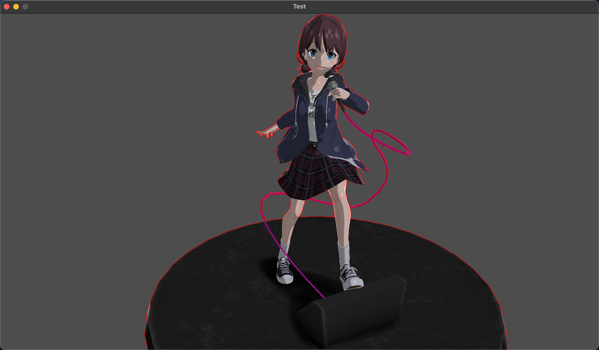
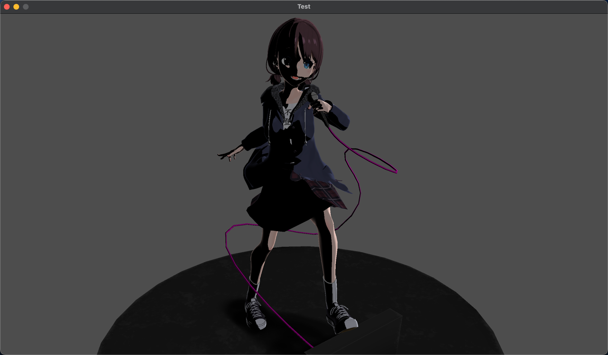
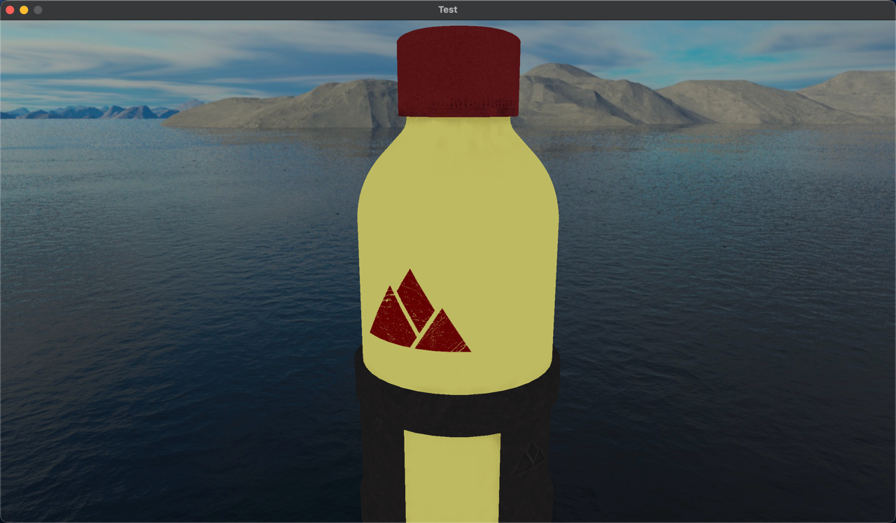
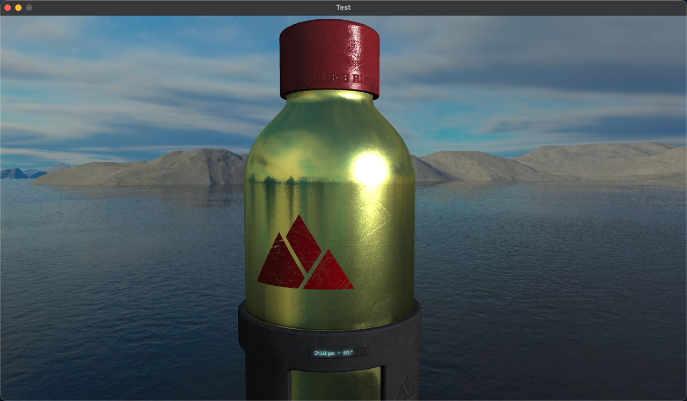
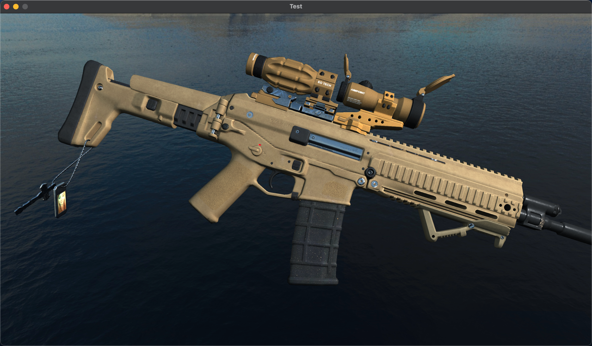
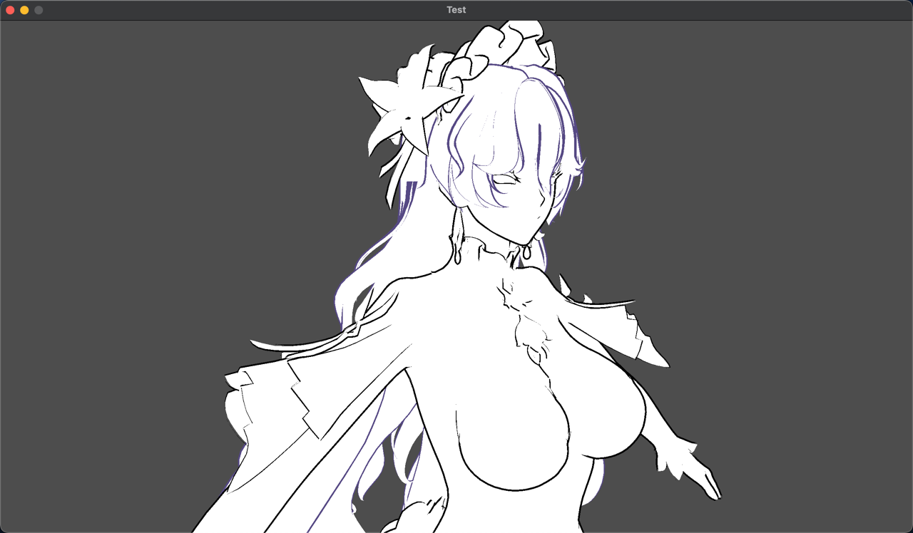
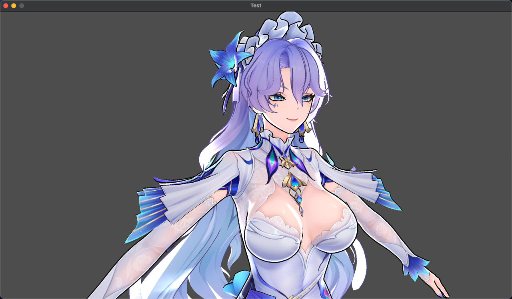
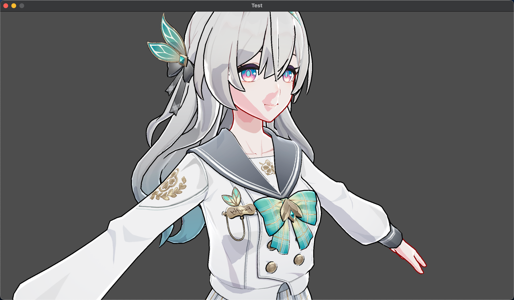

# 使用 OpenGL 的渲染测试
## 仅使用贴图颜色

> 分支：base
## 添加光照

> 分支：light
## 漫反射，高光分层，边缘光，角色描边

> 分支：toon
## AI 实现的卡通渲染

> 分支：toon_ai
## pbr 完全体水杯
 

> 分支：bottle

> 分支：gun
## 通过渲染只背面描边

## 修改后的渲染效果

## 支持动画
<video controls="controls" width="100%" height="auto">
      <source src="anim.mp4" type="video/mp4">
</video>

> 分支：main