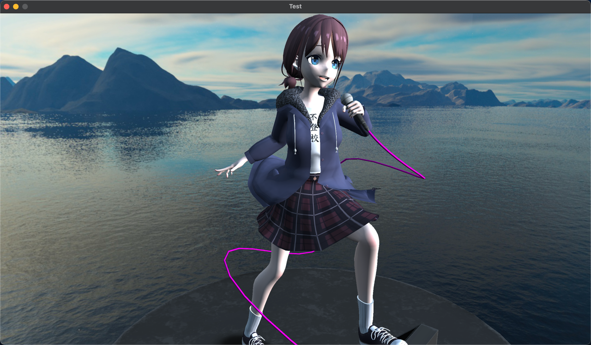

# 使用 OpenGL 的渲染测试
使用 OpenGL 进行 PBR 卡通（三渲二）渲染，支持 glTF 模型与 mmd 的 pmx 模型与其 vmd 动画播放
## 仅使用贴图颜色

> 分支：base
## 添加光照

> 分支：light
## 漫反射，高光分层，边缘光，角色描边

> 分支：toon
## AI 实现的卡通渲染

> 分支：toon_ai
## pbr 完全体水杯
 

> 分支：bottle

> 分支：gun
## 通过渲染只背面描边

## 修改后的渲染效果

## 支持动画
https://github.com/user-attachments/assets/27a9be18-338e-459a-8fa6-2951e317c415
> 分支：main
