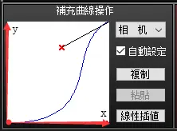
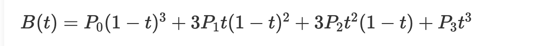

# BoneFrames 骨骼动画
Bone 骨骼名称 
Time 动作所在的帧 
Translate 位移动画 
RotateQuat 旋转四元数 
XCurve YCurve ZCurve x,y,z 位移曲线 
RCurve 旋转曲线 
曲线数据为 16 byte 每 4 个读取第一个就行，得到的是下图中的两个控制点的位置(每个控制点范围 0~127) 
 
加上默认的点 (0,0) (127,127) 组成 三阶贝塞尔曲线

# MorphFrames 表情帧
Morph 变形名称 
Time 变形帧 
Weight 变形比例(线性插值) 
# CameraFrames 相机帧
Time 时间帧 
Translate 相机位置 
RotateXYZ 相机旋转 
Distance ViewAngle Ortho 相机设置 
Curve 变化曲线 只看前 4 个即可 
# LightFrames 光源帧
Time 时间帧 
Color 光源颜色 
Direction 光源方向 
线性插值